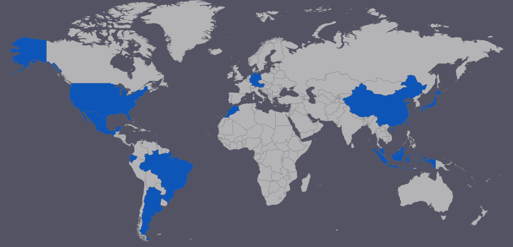

My name is Haozhe (Herman) An. I'm currently a Ph.D. student at University of Maryland, College Park.

I obtained my B.S. in Computer Science from University of California, San Diego with Summa Cum Laude (GPA: 3.987/4.0) in 2019. I am interested in theoretical computer science and deep learning. 

Email: haozhean36@gmail.com 

I also have a [LinkedIn profile](https://www.linkedin.com/in/haozhe-an/). Full CV is available upon request.

## Research Experience
I was fortunate to intern at Baidu Research, Beijing China. My mentors were [Dr. Haoyi Xiong](https://sites.google.com/site/haoyixiongshomepage/), Dr. Xingjian Li and Dr. Dejing Dou. We mainly worked on interpretability of deep learning and transfer learning. [Our work](http://proceedings.mlr.press/v119/li20r.html) was published at ICML 2020.

Prior to my internship at Baidu, I did research in Fine-grained Complexity and Algorithm Design under [Dr. Russell Impagliazzo](http://cseweb.ucsd.edu/~russell/)'s supervision. I was part of a reasearch group of four. I was supported by UC Scholars Program for the duration of the research. Slides for my presentation in Summer Research Conference at UC San Diego are available [here](https://www.slideshare.net/slideshow/embed_code/key/Hc1Jnnw5Wpx1vp).

I also have previous research experience in human-robot interaction and natural language processing.

## Honors and Awards
- UMD Dean’s Fellowship (2020)
- Phi Beta Kappa Society (2019 - present)
- [UC Scholars Program Award](https://students.ucsd.edu/sponsor/uc-scholars/index.html) (2019)
- Tau Beta Pi Engineering Honor Society (2018 - present)
- [Max Planck Society Travel Fellowship](https://cmmrs2018.mpi-sws.org/) (2018)
- Singapore SM1 School-based Scholarship (2011 - 2015)

## Life is more enjoyable with...
### Traveling 
I love traveling to different places with my family and friends. There are uncountable elements in these trips that make them memorable: The unforgettable experience of seeing an amazing and unique glacier landscape in El Calafate, Argentina, the fun conversations with people from all over the world in the desert of Morocco, the stupid and embarrassing cultural mistakes I have commited while transiting in Netherlands, the scrumptious Ichiran ramen I had multiple times with my Singaporean friends... 

I was at Potato Chip Rock in San Diego.

I also enjoy having road trips. It was a great experience driving along Route 66 from Chicago all the way to Los Angeles with my greatest clique ever. Drving from San Francisco to Los Angeles on California State 1 with some of my best high school friends was another awesome trip.

One really important thing: Thanks to my parents who have been generously supporting me to travel around the world and open my eyes!

Here is a map of the countries that I have visited.

I have visited:
China (Of course - I'm from here), Singapore, Malaysia, Indonesia, Japan, Brazil, Argentina, Mexico, Ecuador, United States, Germany, Austria, Morocco

### Reading
Here is a list of books I particularly enjoyed reading.

I read them in English:
- `The Kitchen God's Wife` by Amy Tan
- `Sapiens: A Brief History of Humankind` by Yuval Noah Harari 
- `What If?: Serious Scientific Answers to Absurd Hypothetical Questions` by Randall Munroe 
- `Algorithms to Live By: The Computer Science of Human Decisions` by Brian Christian and Tom Griffiths 

I read them in Mandarin Chinese:
- `Se una notte d'inverno un viaggiatore (If on a winter's night a traveler)` by Italo Calvino
- `Il visconte dimezzato (The Cloven Viscount)` by Italo Calvino
- `Le città invisibili (Invisible Cities)` by Italo Calvino
- `L'Arbre des possibles (The Tree of Possibles)` by Bernard Werber
- `撒哈拉的故事 (The Stories of the Sahara)` by 三毛 (Sanmao)
